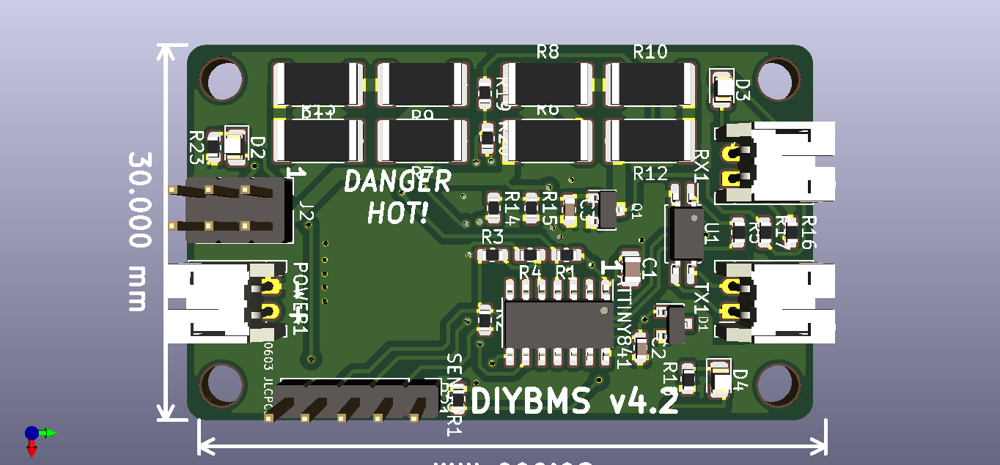

# Last Controller:

# Last Modules:

# diyBMS v4

Version 4 of the diyBMS

Do it yourself battery management system for Lithium ion battery packs/cells

If you are looking for version 3 of this project take a look here https://github.com/stuartpittaway/diyBMS

# TRAVIS-CI

# Videos on how to use and build

https://www.youtube.com/stuartpittaway

# WARNING

This is a DIY product/solution so don’t use this for safety critical systems or in any situation where there could be a risk to life.  

There is no warranty, it may not work as expected or at all.

The use of this project is done so entirely at your own risk.  It may involve electrical voltages which could kill - if in doubt, seek help.

The use of this project may not be compliant with local laws or regulations - if in doubt, seek help.

# License

This work is licensed under a Creative Commons Attribution-NonCommercial-ShareAlike 2.0 UK: England & Wales License.

https://creativecommons.org/licenses/by-nc-sa/2.0/uk/

You are free to:
* Share — copy and redistribute the material in any medium or format
* Adapt — remix, transform, and build upon the material
The licensor cannot revoke these freedoms as long as you follow the license terms.

Under the following terms:
* Attribution — You must give appropriate credit, provide a link to the license, and indicate if changes were made. You may do so in any reasonable manner, but not in any way that suggests the licensor endorses you or your use.
* Non-Commercial — You may not use the material for commercial purposes.
* ShareAlike — If you remix, transform, or build upon the material, you must distribute your contributions under the same license as the original.
* No additional restrictions — You may not apply legal terms or technological measures that legally restrict others from doing anything the license permits.

Notices:
You do not have to comply with the license for elements of the material in the public domain or where your use is permitted by an applicable exception or limitation.

No warranties are given. The license may not give you all of the permissions necessary for your intended use. For example, other rights such as publicity, privacy, or moral rights may limit how you use the material.

# Problem

A DIY Powerwall is the DIY construction of a pack of battery cells to create an energy store which can be used via inverters to power electrical items in the home. Generally cells are salvaged/second hand, and typically use Lithium 18650 cells.

Lithium batteries need to be kept at the same voltage level across a parallel pack. This is done by balancing each cell in the pack to raise or lower its voltage to match the others.

Existing balancing solutions are available in the market place, but at a relatively high cost compared to the cost of the battery bank, so this project is to design a low-cost, simple featured BMS/balancer.

# BMS Design

Design Goals:
* Build upon my existing skill set and knowledge.
* Building something that others can contribute to using regular standard libraries and off the shelf components.
* Build something that is inheriently safe
* Use platform.io to manage code and libraries
* Use Arduino based libraries and tools
* Put everything on GITHUB
* Document it (always gets left to the end!)

# How it works

Controller provides human interface over Wifi/Web and also integrates with other systems like MQTT, emonCMS and Grafana.

Controller is esp8266-12e (NodeMCU v1) - although could be upgraded to ESP32 if really needed.

Controller should be able to take action on alerts/events to shut down inverters/chargers/fuses.

Each cell in a battery pack has a monitoring module.  This uses AVR ATTINY841 linked together by optoisolated serial ports for communication.

ATTINY841 provides:
* internal temperature monitoring
* external temperature monitoring
* Spare input/output for 3rd party use
* autonomous cell voltage balancing - it should still work even if controller is down

# How as v4 improved over v3?

* Code is better!
* Web interface no longer requires access to internet to download javascript libraries
* Controller provides outputs for integration with relay boards and switch gear
* Rules to control relay outputs
* Cell modules use ATTINY841 chip which provides more pins and lower power usage
* Removal of 3.3v regulator and ADUM chips lowers current usage significantly
* v3 module uses 10-12mA current constantly and v4 uses <1mA
* Dual temperature monitoring board + cells
